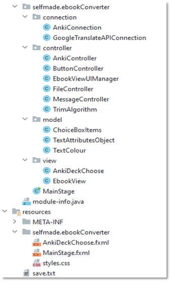
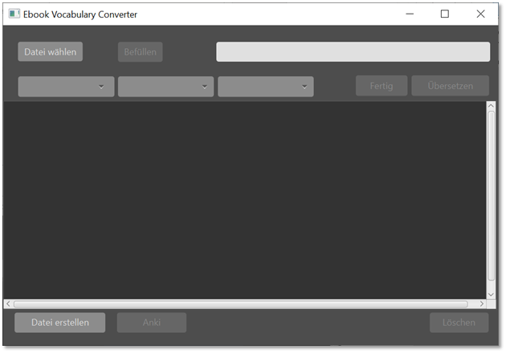
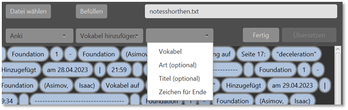
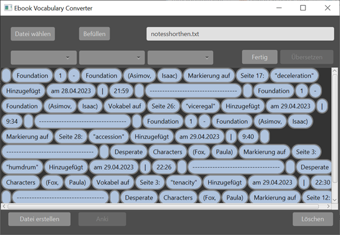
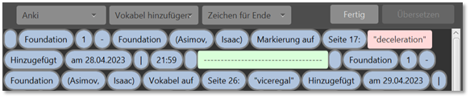
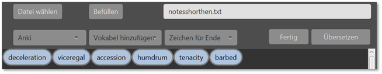
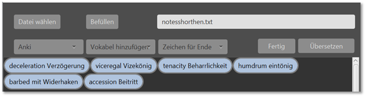
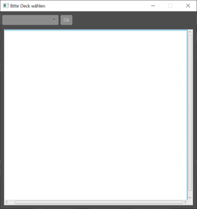
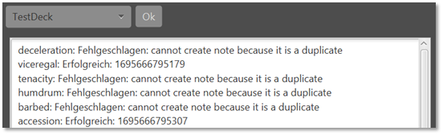

## EbookVocabularyConverter (EVC)
### Introduction

EbookVocabularyConverter is a private desktop application designed to enhance language learning through interactive vocabulary extracted from ebooks. It allows users to mark, translate, and transfer vocabulary to Anki for efficient study, all within a user-friendly GUI.
### Features

  * Interactive Vocabulary Display
  * Marking and Extraction
  * Translation Integration
  * Anki Integration

### Requirements

  * JDK Temurin 17
  * Anki with Ankiconnect installed and activated
  * Internet connection for translation and Anki synchronization
  * Google Cloud Translate API key (not provided in the repo)

### Usage
#### Launching the Application

The EVC is intended for private use only. The API key for GCP is not included; if you own or have acquired one for your personal use, feel free to clone and use the EVC. However, please note that it is not possible to build a JAR due to conflicts with Google Libraries, even though the Google Libraries BOM is used to resolve transitive dependencies.

  ##### Project Structure in IntelliJ:
  

#### Interacting with the Main Window

The main window is where most of the application's interaction takes place. Here, you can load your ebook files, select words or phrases, and view your vocabulary list.

  ##### Main Window:
  

### Making Selections

Use the choice box to make selections for title, type, endmark, and vocabulary. This feature allows you to filter and specify the text you want to focus on. The title is a concatenated string, allowing for the selection of more than one word.

   ##### Choice Box Selections:
   

### Displaying Vocabulary from Text File

Once an ebook is loaded, the application displays the text as interactive buttons. This view allows you to select and mark words directly from the text.

   ##### Main Window with Text Buttons:
   

### Marking Vocabulary

Once an ebook is loaded, the application displays the text as interactive buttons. This view allows you to select and mark words directly from the text.

   ##### Marked Vocabulary:
   

### Displaying Trim Algorithm Results

After selecting a word and an end mark as the minimal requirement, you can click 'Fertig' to start the algorithm, which extracts the vocabulary from the txt file.

   ##### Trim Algorithm Result:
   

### Translating Vocabulary

Selected words can be translated using the integrated Google Cloud Translate feature. The translations are then displayed with the translated word.

  ##### Translation Display:
   

### Choosing Anki Deck

Select the Anki deck you wish to export your vocabulary to. Ensure that the Anki application is installed and the AnkiConnect plugin is activated

   ##### Anki Deck Choice Window:
   
   
### Sending Translations to Anki

After translating and organizing your vocabulary, send it directly to Anki. The application will confirm each successful transfer or notify you of any issues.

   ##### Messages After Sending to Anki:
   

This project is private and is strictly for personal use. The source code and functionality are not licensed for use, distribution, or modification by others. All rights are reserved by the original author David J. Göbels.
